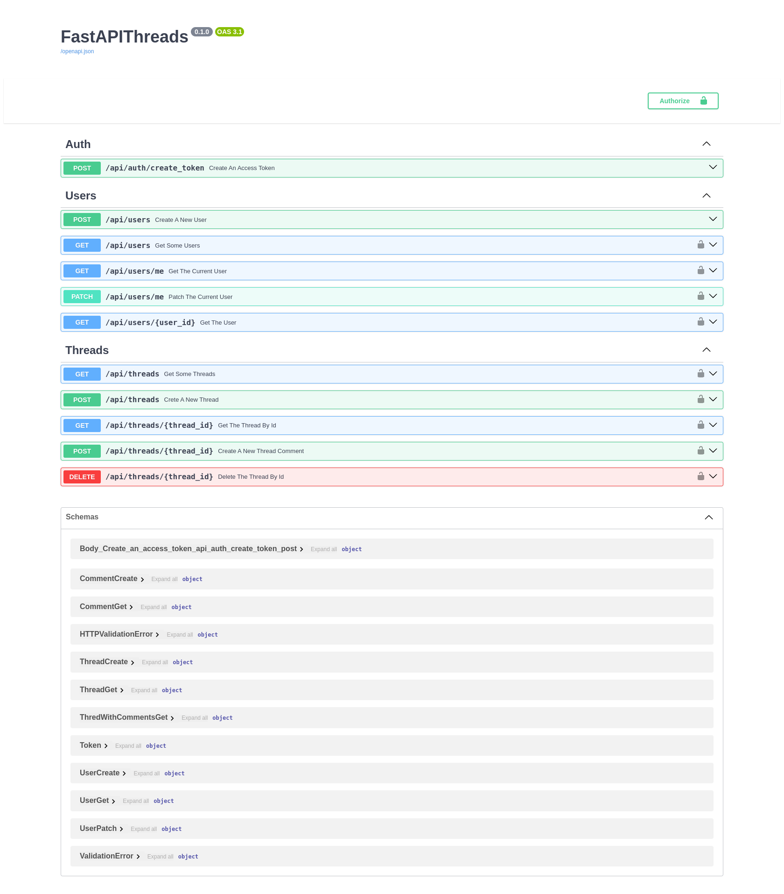

# FastAPI Threads

___

### Description

The example of an asynchronous web application with combination FastAPI and MongoDB. Used Beanie as ODM to link the app
to the database

___

### Getting Started

#### Running on Local Machine

+ install dependencies using Poetry

````
$ poetry install
````

+ configure environment variables in `.env` file
+ start app in virtual environment

````
$ gunicorn -c gunicorn.conf.py asgi:app
````

#### Launch in Docker

+ configure environment variables in `.env` file
+ building the docker image

````
$ docker compose build
````

+ start service

````
$ docker compose up -d
````

____

#### Environment variables

| variables              | description                               |
|:-----------------------|:------------------------------------------|
| `DEBUG`                | debug mode, only allowed 1(True)/0(False) |
| `PORT`                 | app port                                  |
| `JWT_SECRET_KEY`       | a secret key for jwt encoding             |
| `JWT_ALGORITHM`        | jwt encoding algorithm                    |
| `ACCESS_TOKEN_EXPIRES` | access token lifetime in minutes          |
| `MONGO_URL`            | Mongo url                                 |
| `MONGO_DB`             | Mongo database                            |
| `MONGO_URL_TEST`       | Mongo url for tests                       |
| `MONGO_DB_TEST`        | Mango database for tests                  |

____

#### Tech Stack

+ `FastAPI`
+ `pymongo`, `motor` and `beanie`
+ `gunicorn`
+ `pytest`, `pytest-asyncio` and `httpx` for tests
+ `docker` and `docker-compose`